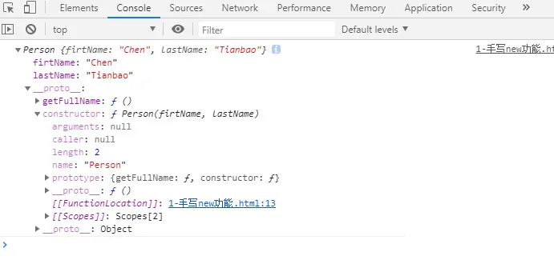
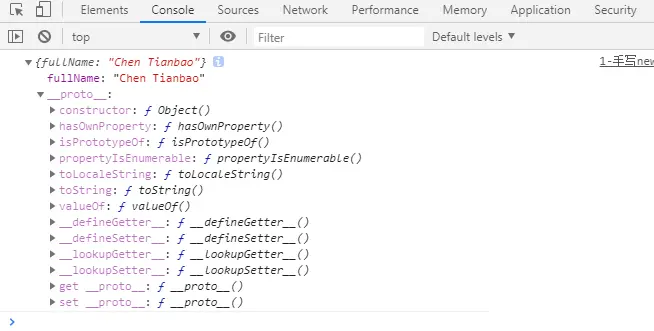
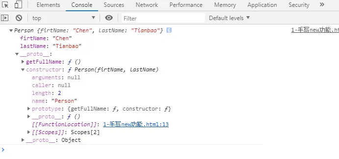
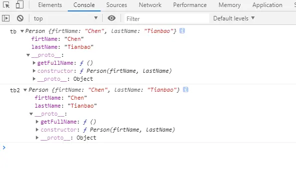

### 目录

- new到底做了哪些事情
- 手写一个new方法

### new到底做了哪些事情

我们先写一段很简单的代码，定义一个Person类, 使用new来创建一个Person的实例.

```js
function Person(firtName, lastName) {
  this.firtName = firtName;
  this.lastName = lastName;
}

Person.prototype.getFullName = function () {
  return `${this.firtName} ${this.lastName}`;
};

const tb = new Person('Zhang', 'San');
console.log(tb);

```

查看一个控制台中tb实例的.




从图中我们可以看到.实例里面有以下东西:

- 两个属性, firtName和lastName, 并均以赋值.
- 原型上有一个getFullName方法和一个构造器.

### 分析完实例后, 我们就很容易知道, new到底做了什么.

- 创建一个新的对象
- 添加父类的属性到新的对象上并初始化.
- 继承父类原型上的方法.
- 返回新对象. 但是? 上面的描述完全正确吗?

我将我们的demo代码, 做一点点更改. 在构造器上添加一个return.

```js
function Person(firtName, lastName) {
  this.firtName = firtName;
  this.lastName = lastName;

  return {
    fullName: `${this.firtName} ${this.lastName}`
  };
}

```

控制台中，看看有什么不一样.




我们发现, 这是执行后, 实际的实例, 返回的就是一个普通的object对象. 这个对象就是执行return时的结果.

我们进一步探索, 如果返回的不是一个对象, 而是一个Nubmer和String, 会怎么样呢?

```js
function Person(firtName, lastName) {
  this.firtName = firtName;
  this.lastName = lastName;

  return 'demo';
}

```

从控制台中, 可以看到, 和没有写return是一样的. 返回的都是新创建的Person实例.



### 经过上面的分析, new到底做了什么事情, 我们就很容易归纳了.

- 创建一个新的对象
- 继承父类原型上的方法.
- 添加父类的属性到新的对象上并初始化. 保存方法的执行结果.
- 如果执行结果有返回值并且是一个对象, 返回执行的结果, 否则, 返回新创建的对象。

### 知道执行的过程后, 如何手写一个new方法. 就变的很容易了.

代码如下:

```js
function _new(obj, ...rest){
  // 基于obj的原型创建一个新的对象
  const newObj = Object.create(obj.prototype);

  // 添加属性到新创建的newObj上, 并获取obj函数执行的结果.
  const result = obj.apply(newObj, rest);

  // 如果执行结果有返回值并且是一个对象, 返回执行的结果, 否则, 返回新创建的对象
  return typeof result === 'object' ? result : newObj;
}

```

测试一下.

```js
const tb = new Person('zhang', 'San');
console.log(tb);

const tb2 = _new(Person, 'zhang', 'San');
console.log(tb2)

```

我们发现tb和tb2的返回值, 完全一样.



